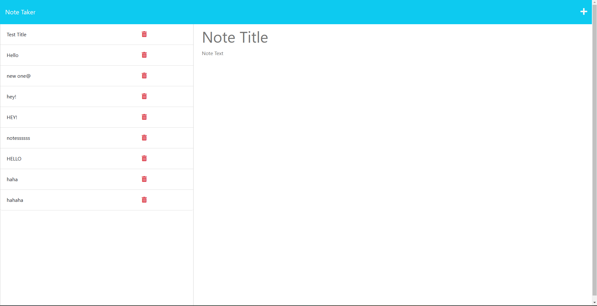

# Custom Notepad
https://github.com/coltonsmith135/custom-notepad

# Description
This project is a web application built from the back end using exress.js to create a custom notpad for the user to be able to take notes. It will help people be able to write down important information.
# Table of Contents:
* [Installation](#installation)
* [Usage](#usage)

* [License](#License)

* [Credits](#credits)
* [Tests](#tests)

## installation

node.js, express, fs

## contact info

coltonsmith135@yahoo.com

## usage

It is used by creating notes on a topic of the users choosing.

## License

  MIT

## credits

Colton Smith

## tests

using insomnia

https://custom-notepad.herokuapp.com/

https://github.com/coltonsmith135/custom-notepad

